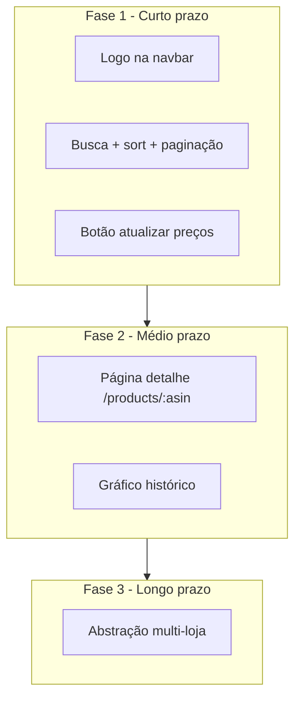
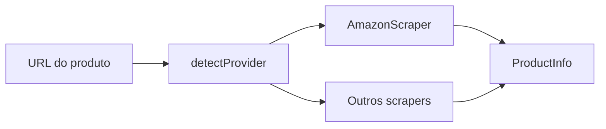

# Roadmap: UX da listagem, monitor pela web e evoluções

## Estado atual

- Listagem em [`src/web/pages/ProductsPage.tsx`](src/web/pages/ProductsPage.tsx) carrega tudo via `GET /api/products` (sem busca, ordenação ou paginação).
- Monitor roda só via CLI [`pnpm start`](package.json) → [`src/index.ts`](src/index.ts) (Playwright + Telegram).
- Ícones já existem em [`public/`](public/) (`icon-192x192.png`, `site-icon-master.png`, favicons) e [`index.html`](index.html) referencia favicon/manifest — falta usar logo na **navbar** e no **login**.
- Dados da API já trazem `previous_price`, `lowest_price`, `created_at` — suficientes para ordenar no front (fase 1).



---

## Fase 1 — Curto prazo (implementar agora)

### 1. Logo no site

**Arquivos:** [`src/web/App.tsx`](src/web/App.tsx), [`src/web/pages/LoginPage.tsx`](src/web/pages/LoginPage.tsx)

- Substituir texto puro "Amazon Price Tracker" por `` + título (ou só logo com `alt`).
- Reutilizar asset em `public/` (já servido pelo Vite).
- Opcional: alinhar `theme_color` do manifest com navbar.

### 2. Disparar atualização de preços pela web

**Problema:** [`src/index.ts`](src/index.ts) é script CLI; a web não pode executar `pnpm start` de forma confiável em produção.

**Abordagem recomendada:**

1. Extrair lógica para [`src/monitor.ts`](src/monitor.ts):
   - `export async function runPriceMonitor(): Promise<MonitorResult>` (lista de produtos verificados, erros, duração).
   - [`src/index.ts`](src/index.ts) vira thin wrapper: `runPriceMonitor().catch(...)`.

2. Nova rota em [`src/server.ts`](src/server.ts):
   - `POST /api/monitor/run` — exige sessão (cookie) ou `x-api-token`.
   - Flag em memória `monitorRunning` para evitar execuções paralelas (retorna `409` se já rodando).
   - Resposta: `{ started: true }` ou resultado síncrono `{ checked, errors }` conforme preferência.

3. UI em [`ProductsPage.tsx`](src/web/pages/ProductsPage.tsx) ou navbar:
   - Botão **"Atualizar preços agora"** com loading/disabled enquanto roda.
   - Toast/alert com resumo ao terminar; recarregar lista (`GET /api/products`).

**Atenção:** Playwright é pesado; com muitos produtos a requisição pode levar minutos. MVP aceitável para poucos itens; evolução futura = job em background + `GET /api/monitor/status`.

### 3. Busca por título

**Onde:** client-side na [`ProductsPage.tsx`](src/web/pages/ProductsPage.tsx) (dados já carregados).

- Input de busca acima da lista.
- Filtrar: `(product.title ?? product.asin).toLowerCase().includes(query)`.
- Resetar página para 1 ao mudar o filtro.

**Evolução opcional:** `GET /api/products?q=...` em [`database.ts`](src/database.ts) se a lista crescer muito.

### 4. Ordenação

**Onde:** client-side (mesma página).

| Opção UI | Campo / cálculo |
|----------|-----------------|
| Data de criação | `created_at` |
| Nome | `title` (`localeCompare` pt-BR) |
| Variação de preço | `(last_price ?? null) - (previous_price ?? null)` — nulls no fim |
| Preço atual | `last_price` |
| Menor preço | `lowest_price` |
| Preço alvo | `target_price` (0 = sem alvo, tratar com `hasTargetPrice`) |

- `<select>` "Ordenar por" + toggle asc/desc.
- Helper `sortProducts(products, sortBy, direction)` em [`src/web/lib/products.ts`](src/web/lib/products.ts) ou [`utils.ts`](src/utils.ts).

### 5. Paginação (10 itens por página)

**Onde:** client-side após filtro + ordenação.

- Constante `PAGE_SIZE = 10`.
- Estado `page` (1-based).
- `visibleProducts = sortedFiltered.slice((page-1)*10, page*10)`.
- Controles DaisyUI: Anterior / Próxima + "Página X de Y".
- Esconder paginação se `total <= 10`.

**Pipeline na página:**

```
products → filter(search) → sort → paginate → render cards
```

---

## Fase 2 — Médio prazo (backlog)

### 6. Página de detalhes do produto

**Rota:** `/products/:asin` em [`App.tsx`](src/web/App.tsx).

**API:** `GET /api/products/:asin` + `GET /api/products/:asin/history`

```sql
SELECT price, checked_at FROM price_history
WHERE product_id = ? AND price IS NOT NULL
ORDER BY checked_at ASC
```

**UI:** [`ProductDetailPage.tsx`](src/web/pages/ProductDetailPage.tsx)

- Cabeçalho: imagem, título, link Amazon, preço alvo.
- Cards: atual, anterior, menor histórico.
- Tabela ou lista do histórico.

### 7. Gráfico de histórico de preços

- Biblioteca leve: **Chart.js** ou **uPlot** (devDependency).
- Componente `PriceHistoryChart.tsx` consumindo `history[]`.
- Eixo X: `formatDateTime(checked_at)`; eixo Y: preço BRL.

---

## Fase 3 — Longo prazo (backlog)

### 8. Suporte a outras lojas além da Amazon

**Complexidade alta** — cada site tem HTML/selectors diferentes e anti-bot.

**Direção arquitetural:**



- Coluna `source` em `products` (`amazon`, `mercadolivre`, ...).
- Interface `ProductScraper { fetchProductInfo(url) }`.
- Refatorar [`fetchProductInfo`](src/database.ts) para delegar ao scraper correto.
- `extractASIN` vira `extractProductId` por provider.
- Avaliar APIs oficiais/afiliados antes de mais Playwright.

---

## Ordem de implementação sugerida (Fase 1)

1. Logo (rápido, sem API)
2. Helpers sort/filter/paginate + UI na ProductsPage
3. Extrair `monitor.ts` + endpoint + botão na web
4. Testes manuais: busca, cada ordenação, paginação >10 itens, monitor com 1–2 produtos

## Arquivos principais tocados (Fase 1)

| Arquivo | Mudança |
|---------|---------|
| [`src/monitor.ts`](src/monitor.ts) | Novo — lógica do monitor extraída de `index.ts` |
| [`src/index.ts`](src/index.ts) | Chama `runPriceMonitor()` |
| [`src/server.ts`](src/server.ts) | `POST /api/monitor/run` |
| [`src/web/pages/ProductsPage.tsx`](src/web/pages/ProductsPage.tsx) | Busca, sort, paginação, botão monitor |
| [`src/web/App.tsx`](src/web/App.tsx) | Logo na navbar |
| [`src/web/lib/products.ts`](src/web/lib/products.ts) | Novo — `filterProducts`, `sortProducts`, `paginateProducts` |

## Fora de escopo desta fase

- Gráfico e página de detalhe (Fase 2)
- Multi-loja (Fase 3)
- Paginação server-side (só necessária com centenas de produtos)
